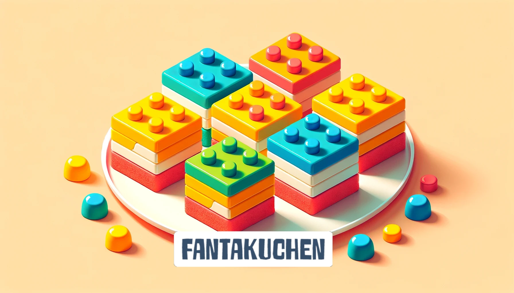

    

    

# 🍰 Kuchengine

**Kuchengine** is a modular game development boilerplate built with [Nx](https://nx.dev), [Phaser](https://phaser.io), and [React](https://react.dev). It provides a scalable architecture for creating 2D games using a functional-first approach, with clear separation between game logic, engine systems, and UI overlays.

## 📚 Philosophy

Kuchen aims to provide a reusable, testable, and composable foundation for building modern 2D games.

## 🧁 Made with love and too much coffee
